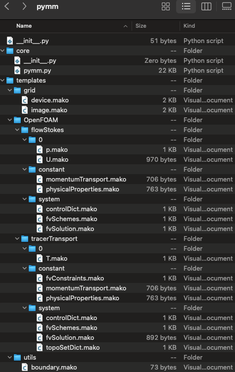

pymm Python API
===============

The main script for the ``pymm`` executable is located in the package core. It
contains CLI coordination, the shared configuration data class, image and
boundary processing, Gmsh generation, OpenFOAM workflows, and terminal helpers.
The templates directory contains Mako files for Gmsh and OpenFOAM input.

   Files in the pymm package.

The API pages are regenerated into ``docs/text/api`` before each documentation
build. This avoids duplicate or stale root-level generated files.

.. toctree::
   :maxdepth: 2

   api/modules
